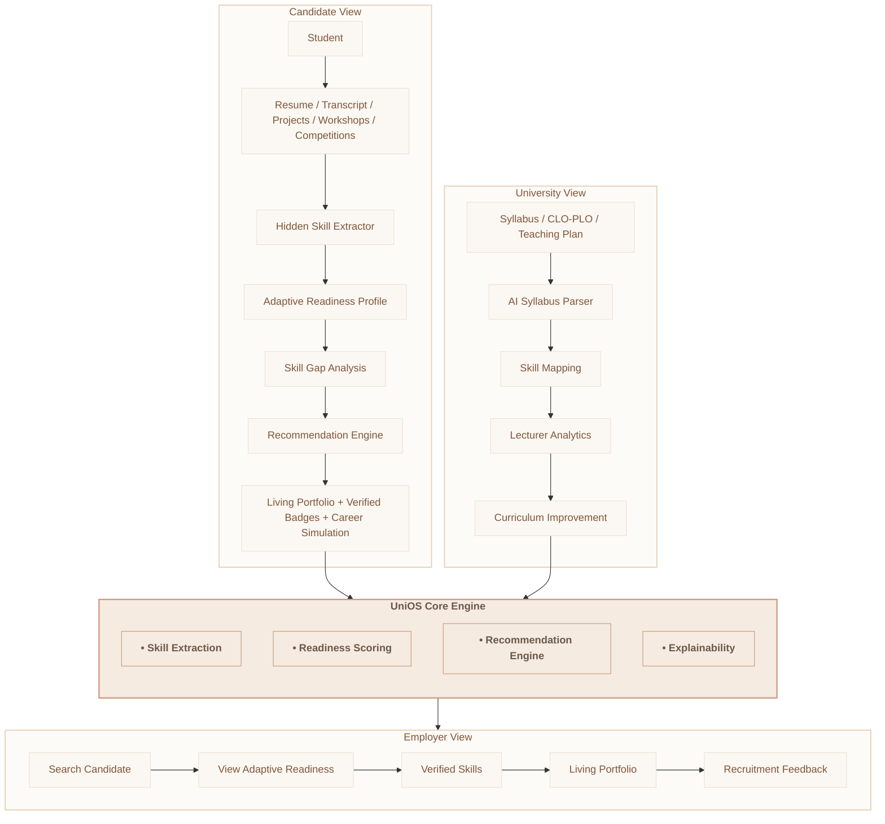

# UniOS- The Data-Driven Talent Alignment Ecosystem 
"Transforming academic data into real-world career intelligence."
- ---
## 📌Overview
UniOS is an AI-powered talent alignment system that transforms academic and experiential data into structured career intelligence. 
- It helps
  - Students understand their skills and career readiness
  - Universities improve curriculum alignment
  - Employers identify verified talent beyond academic grades
- ---
## 🚨 Problem
Traditional education and recruitment systems fail to reflect real-world employability. 
- Academic metrics (CGPA, attendance, coursework) do not represent practical skills or job readiness.
- University certificates typically represent a snapshot of a student's ability at graduation, rather than ongoing learning and skill development.
- Students rely on memory-based resumes, leading to incomplete skill representation.
- ---
## 💡 Solution
- UniOS transforms fragmented data into structured career intelligence.
 It:
- Extracts hidden skills from academic & project data
- Continuously evaluates career readiness
- Builds evidence-based career portfolios
- Aligns education outcomes with industry demand
- ---
## ⚡ Key Features
- AI Skill Extraction Engine
- Adaptive Readiness Profile (ARP)
- Living Career Portfolio Generator
- Curriculum-to-industry Alignment Engine
- Explainable AI Talent Matching
- ---

## 🧭 System Functional Architecture

- ---
## 🧭 System Flow
- **Student Pipeline** → uploads academic & experiential data → AI extracts skills → builds ARP → generates portfolio  
- **University Pipeline** → processes syllabus & CLO/PLO → maps skills → generates curriculum insights  
- **Employer Pipeline** → searches verified profiles → evaluates ARP & portfolio → provides hiring feedback → generates final shortlist
- - ---
## 🛠 Tech Stack
- **Frontend**: React / Next.js / TailwindCSS / Framer Motion
- **Backend**: FastAPI / Next.js / Supabase / Vercel / LlamaIndex
- **AI Layer**: Groq (Llama 3 70B) + Prompt Engineering + Explainable AI (XAI)
- **Intelligence Pipeline**: Resume Parser / Skill Extraction Pipeline / Readiness Scoring Engine / Recommendation Engine / Explainability Generator
- ---

## 📊 Impact
- Reduces reliance on static academic grading  
- Makes hidden skills visible through AI extraction  
- Enables continuous career tracking  
- Improves hiring accuracy with verified talent data  
